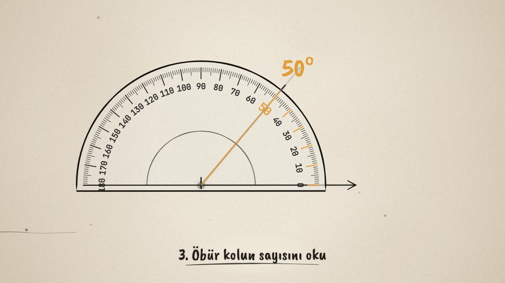
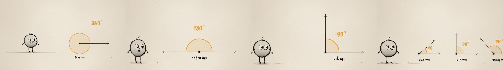

# Kaç Derece? · How Many Degrees?

**▶ Tarayıcıda izleyin / Watch in the browser:** https://hakanatas.github.io/kac-derece/ 
**⬇ MP4 + altyazılar / MP4 + subtitles:** [Releases](https://github.com/hakanatas/kac-derece/releases) 
**✎ Kullanılan istem / The prompt behind it:** [PROMPT.md](PROMPT.md)

> **TR —** 5. sınıf matematik "Geometrik Şekiller" temasındaki MAT.5.3.3 öğrenme çıktısı (açıları ölçme) için hazırlanmış, tamamen JavaScript ile çizilen 92 saniyelik mürekkep animasyonu. Nokta; derecenin ne olduğunu, tam, yarım ve çeyrek turu ve açıölçerle üç adımda ölçmeyi gösteriyor. Altyazılar Türkçe, İngilizce ya da ikisi birlikte seçilebilir.

A 92-second ink animation for **5th-grade maths**, drawn entirely with JavaScript on an HTML5 canvas. Nokta, the ink character from [The Learning Ink](https://github.com/hakanatas/the-learning-ink), shows how to measure angles: what a degree is, full, half and quarter turns, and how to use a protractor in three steps.

It continues the geometry series after [Noktadan Çembere](https://github.com/hakanatas/noktadan-cembere), which covered MAT.5.3.1–5.3.2. This film teaches the next outcome, **MAT.5.3.3**.

## Learning outcome

MEB, Türkiye Yüzyılı Maarif Modeli, Ortaokul Matematik, 5th grade, "Geometrik Şekiller" theme:

**MAT.5.3.3. Açıları ölçmek için matematiksel araç ve teknolojiden yararlanabilme**
- a) Açı ölçmek için gerekli araç ve teknolojiyi tanır.
- b) Açı ölçmek için uygun araç ve teknolojiyi belirler.
- c) Açı ölçmek için uygun araç ve teknolojiyi kullanır.

The program's notes ask for students to examine the protractor and learn the degree as the standard unit of angle measure. They also name three angles: the full angle (one complete turn), the straight angle (half of a full angle) and the right angle (90°).

## Designed to be easy to follow

- One idea per scene, with a single short caption on screen at a time.
- The same colour rule all the way through: **black ink = the angle's arms**, **amber = a measurement** (the opening and its degrees).
- The degree number counts up live as the arm turns, so the number and the movement stay linked.
- The protractor is taught in three numbered steps.
- The protractor shows a single scale (0 on the right). Real protractors have two scales; this keeps the first lesson simple. When you move on to two-scale protractors, tell students to start counting from the 0 that sits on the arm.

## Scenes

| # | Time | Scene | What happens | Outcome |
|---|---|---|---|---|
| 1 | 0–12 s | Bu bir açı | Nokta is born from a drop of ink and draws two rays from the same point. "How wide is it?" | Intro |
| 2 | 12–30 s | Tam tur | The arm turns once all the way round while the amber arc counts up to **360°** (full angle). 360 tick marks appear, then the camera zooms in on one of them: **1°**. | 5.3.3 · degree, full angle |
| 3 | 30–46 s | Yarım ve çeyrek tur | Half a turn is **180°**, a straight angle. A quarter turn is **90°**, a right angle, marked with a small square. | 5.3.3 · straight and right angle |
| 4 | 46–66 s | Açıölçer | An unknown angle, measured in three steps: ① put the centre on the vertex, ② line up the 0 line with one arm, ③ read the number the other arm passes. The answer is **50°**. | 5.3.3 a–c |
| 5 | 66–80 s | Dar, dik, geniş | As the arm opens, the reading grows from 50° to 130°. Then 40°, 90° and 130° angles appear side by side as acute, right and obtuse. | 5.3.3 c · a reminder of angle types |
| 6 | 80–92 s | Kapanış | Nokta celebrates: "Açıölçerle ölç, dereceyle söyle!" (Measure with a protractor, say it in degrees!) | Wrap-up |

## Running it

- **Preview:** double-click `index.html` (it works offline). Controls: play/pause, timeline, scene jump, speed, 16:9 or 9:16, and captions Off / TR / EN / TR+EN.
- **MP4:** run `npm install` once, then `npm run export -- --format=horizontal --captions=tr`.
- **Subtitles and narration:** `npm run srt` writes `out/captions_*.srt` and `narration_notes.txt`.
- **Editing:**
  - Caption text and timings: `captions.js`
  - Scenes: `scenes/scene1.js` … `scene6.js`
  - The angle's movement over time, the protractor's path and Nokta's poses: `src/draw/film.js`
  - The protractor and angle drawings: `src/draw/angles.js`

It uses the same engine as The Learning Ink: `renderFrame(t)` as a pure function of time, seeded randomness, and frame-by-frame export.
